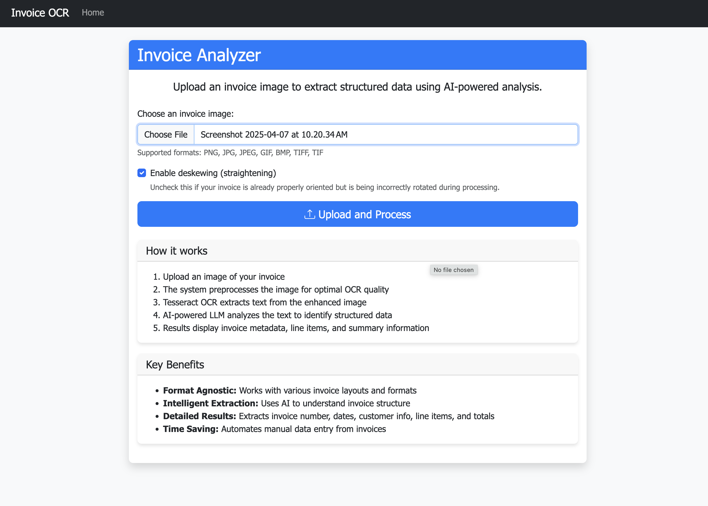
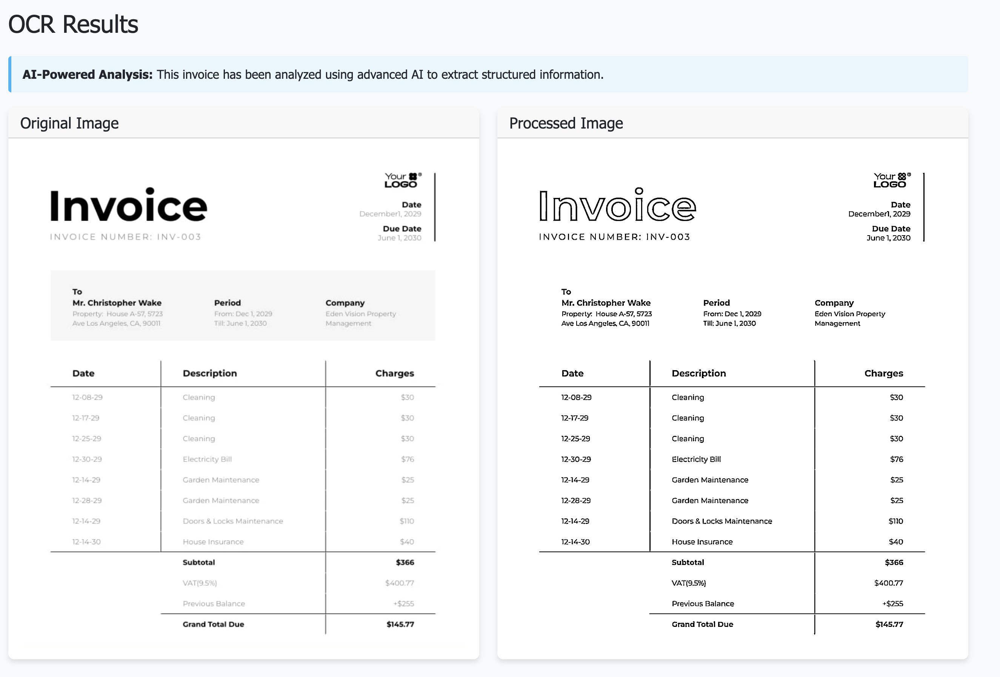
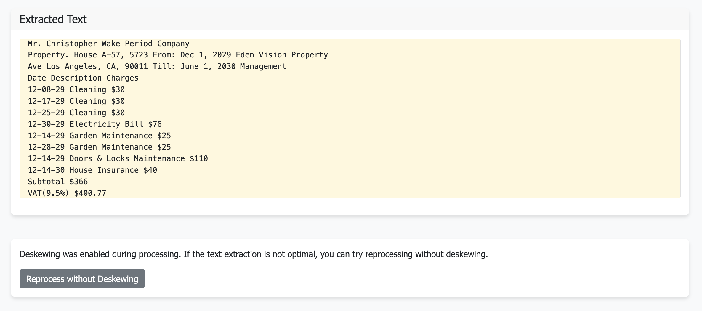
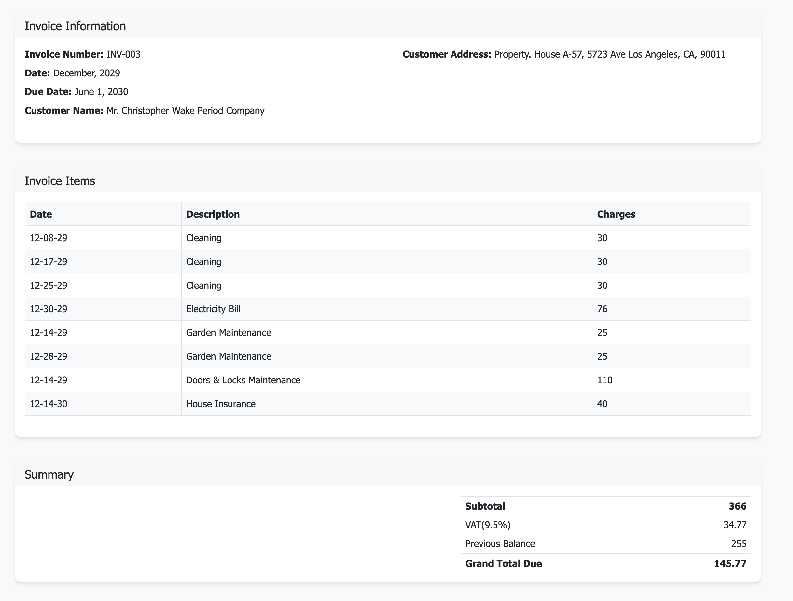

# AI-Powered Invoice OCR System

A Python-based application for scanning invoices and extracting structured data using OCR and AI. This system processes invoice images, extracts text, and uses LLM inference to identify and organize key information in a structured format.

## Key Features

- **Advanced Image Preprocessing**
  - Automatic deskewing for misaligned documents
  - Image enhancement for better OCR results
  - Adaptive thresholding for improved text contrast

- **OCR Text Extraction**
  - High-accuracy text extraction using Tesseract OCR
  - Support for various image formats (PNG, JPG, JPEG, GIF, BMP, TIFF)

- **AI-Powered Invoice Parsing**
  - LLM-based extraction of structured data from raw OCR text
  - Automatic identification of invoice metadata, line items, and totals
  - Format-agnostic processing that works across different invoice layouts

- **User-Friendly Web Interface**
  - Simple upload and processing workflow
  - Clear presentation of extracted data
  - Original and processed image comparison

## Screenshots

Here are some screenshots demonstrating the application's features:

### Home Page

*The application's home page featuring the upload form and instructions.*

### Processed Image Result

*Side-by-side comparison of original and processed images with enhanced clarity for OCR.*

### Text Extraction

*Raw text extraction from the processed image using Tesseract OCR.*

### Structured Data Extraction

*AI-powered extraction of structured invoice data including tables and totals.*

## Requirements

- Python 3.8+
- Tesseract OCR engine
- Groq API key (for LLM inference)
- Flask and other dependencies in requirements.txt

## Installation

1. Clone the repository
   ```
   git clone https://github.com/yourusername/ocr-document-scanner.git
   cd ocr-document-scanner
   ```

2. Create and activate a virtual environment
   ```
   python -m venv venv
   source venv/bin/activate  # On Windows, use: venv\Scripts\activate
   ```

3. Install the required packages
   ```
   pip install -r requirements.txt
   ```

4. Install Tesseract OCR engine:
   - On macOS: `brew install tesseract`
   - On Ubuntu/Debian: `sudo apt-get install tesseract-ocr`
   - On Windows: Download the installer from [here](https://github.com/UB-Mannheim/tesseract/wiki)

5. Set up environment variables:
   - Copy `.env.example` to `.env`
   - Add your Groq API key for LLM inference
   ```
   GROQ_API_KEY=your-api-key-here
   ```

## Usage

1. Start the Flask application:
   ```
   python app.py
   ```

2. Open a web browser and navigate to `http://localhost:5000`

3. Upload an invoice image to process

4. View the extracted data including:
   - Invoice metadata (number, date, customer info)
   - Table of line items
   - Summary information (subtotal, tax, total)

## How It Works

1. **Image Preprocessing**: The system enhances the uploaded image for better OCR results, including deskewing, denoising, and thresholding.

2. **Text Extraction**: Tesseract OCR extracts raw text from the processed image.

3. **AI Analysis**: The raw text is sent to Groq's LLM (Llama 3 70B) for intelligent parsing and structuring.

4. **Data Presentation**: The structured information is presented in a user-friendly format, showing invoice metadata, line items, and summary totals.

## Project Structure

```
ocr-document-scanner/
│
├── app.py               # Main Flask application
├── requirements.txt     # Project dependencies
├── .env.example         # Environment variables template
│
├── static/              # Static files (CSS, JS, images)
│   ├── css/             # CSS stylesheets
│   ├── uploads/         # User uploaded documents
│   └── processed/       # Processed images
│
├── templates/           # HTML templates
│   ├── base.html        # Base template with layout
│   ├── index.html       # Home page
│   └── result.html      # Results page
│
├── utils/
│   ├── ocr.py           # OCR functionality
│   ├── preprocessing.py # Image preprocessing
│   └── parser.py        # AI-powered data parsing
│
└── snapshots/           # Application screenshots
```

## API Integration

The system uses Groq's API to access powerful LLM capabilities. You'll need to:

1. Sign up for a Groq account at https://console.groq.com/
2. Generate an API key
3. Add it to your `.env` file as `GROQ_API_KEY=your-key-here`

## Limitations

- Currently optimized for invoice processing; other document types may have limited support
- Language support depends on Tesseract OCR language packs
- Heavy processing may take several seconds per document

## Contributing

Contributions are welcome! Please feel free to submit a Pull Request.
